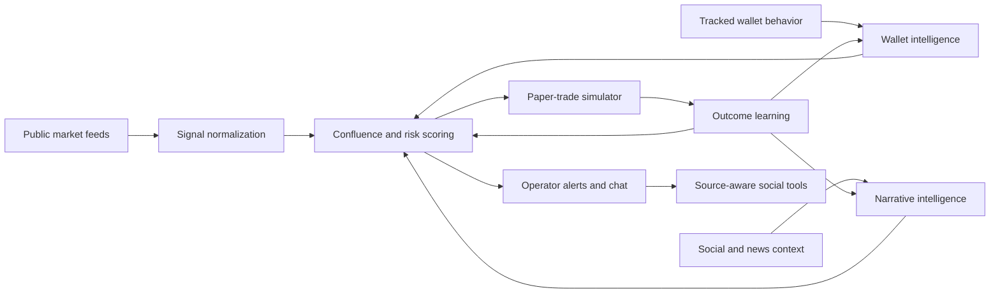

# Eclipse AI

**Eclipse is a private autonomous AI operator for market intelligence, wallet analytics, narrative tracking, paper-trade simulation, and source-aware social execution.**

This repository is the public technical dossier for Eclipse. It explains what the system does, how its major subsystems fit together, and where the security boundary is drawn. It is not an open-source release of the private runtime.

The private codebase, backend services, model prompts, API credentials, wallet data, browser profiles, runtime state, logs, strategy implementation, and execution infrastructure are intentionally not published.

## What Eclipse Is

Eclipse is built around one operating loop:

1. Observe public market, wallet, and social activity.
2. Convert raw events into structured signals.
3. Compare signals against wallet reputation, market structure, narrative strength, and risk evidence.
4. Simulate trade decisions with entry market cap, sizing, exits, and outcome tracking.
5. Feed results back into memory so future decisions become more selective.
6. Use operator-controlled social tools to react publicly with source context attached.

The system is designed for fast-moving environments where narrative, liquidity, wallet behavior, and timing all matter at once.

## System Snapshot

| Area | Public description |
| --- | --- |
| Signal ingestion | Watches public launch, migration, market, news, and social signals. |
| Wallet intelligence | Tracks wallet behavior, reputation, round trips, and funding relationships. |
| Risk analysis | Reviews holder concentration, liquidity quality, suspicious clustering, and manipulation patterns. |
| Narrative engine | Maps public posts, cultural hooks, news events, and token lore into structured context. |
| Paper trading | Simulates entries, exits, sizing, entry market cap, PnL, and strategy outcomes. |
| Memory | Stores compact decisions and learned summaries instead of raw private logs. |
| Agent integrations | Uses local agent adapters such as Hermes and optional gateway coordination through OpenClaw. |
| Social execution | Supports source-aware posts, quote context, reply safety, and thread-safe long-form posting. |

## Architecture At A Glance

## What Is Public Here

- High-level architecture
- Capability summaries
- Public security boundary
- Privacy posture
- Roadmap principles
- FAQ and public identity links

## What Is Not Public

- Runtime or backend source code
- Trading strategy implementation
- Exact private thresholds, prompts, memory, or coordination state
- Wallet private keys, seed phrases, watchlists, raw wallet dumps, or operational wallet addresses
- API keys, provider credentials, webhook URLs, OAuth material, cookies, or browser profiles
- Logs, local databases, `.env` files, screenshots with private dashboards, or infrastructure configuration

See [Security Boundary](docs/SECURITY_BOUNDARY.md) for the full publication policy.

## Documentation

- [Architecture Overview](docs/ARCHITECTURE.md)
- [Capabilities](docs/CAPABILITIES.md)
- [Hermes and OpenClaw Integrations](docs/INTEGRATIONS.md)
- [Security Boundary](docs/SECURITY_BOUNDARY.md)
- [Privacy and Data Handling](docs/PRIVACY.md)
- [Public Verification](docs/VERIFICATION.md)
- [Roadmap](docs/ROADMAP.md)
- [FAQ](docs/FAQ.md)

## Official Links

- X/Twitter: [@EclipseAI127305](https://x.com/EclipseAI127305)
- GitHub: [eclipseai-xx/eclipse-ai-public](https://github.com/eclipseai-xx/eclipse-ai-public)

## Status

Eclipse is an active private research and operations system. This repository exists so the public can verify the project identity and understand the technical shape of the agent without exposing sensitive infrastructure.

## Disclaimer

Eclipse is experimental software. This repository is not financial advice, trading advice, an offer to trade, or a promise of market performance. Any live or simulated market behavior should be treated as high risk.
