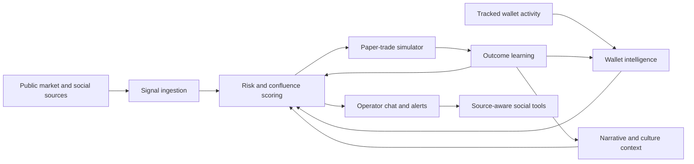

# Architecture Overview

Eclipse is structured as a local-first autonomous agent runtime with separate lanes for market ingestion, wallet intelligence, narrative context, paper-trade simulation, memory, and operator-facing chat/social control.

This page describes the architecture at a safe public level. It intentionally avoids private source code, thresholds, wallet lists, API contracts, prompts, and execution logic.

## High-Level Flow

## Core Subsystems

### Signal Ingestion

Eclipse watches public launch, migration, market, and social context. The ingestion layer normalizes candidate events into a shared scoring pipeline so raw market events and social narratives can be compared consistently.

### Wallet Intelligence

The wallet layer tracks known wallets, builds reputation from observed behavior, studies buy/sell round trips, and looks for funding relationships between wallets. The goal is to separate real early positioning from low-quality noise.

### Risk and Confluence

The scoring layer combines wallet reputation, market structure, liquidity, holder distribution, volume quality, narrative strength, and risk evidence. Unsafe or low-confidence setups can be downgraded or blocked before any simulated entry.

### Narrative Intelligence

Eclipse tracks internet culture, news hooks, public tweets, lore patterns, and tech-driven narratives. This lets the system treat generic low-signal launches differently from tokens attached to unusually strong attention events.

### Paper-Trade Simulation

The simulator records simulated entry size, entry market cap, exit timing, profit/loss, and exit reason. Outcomes feed learning loops so future decisions can adapt to what actually worked or failed.

### Shared Memory

Eclipse stores compact decisions and learned summaries rather than raw dumps. This keeps agent continuity high without turning memory into a secret-filled log archive.

### Social Execution

The social layer is operator-controlled and source-aware. When Eclipse comments on a public trend, it is designed to preserve context through quote/retweet/source attachment instead of posting disconnected opinions.

## Privacy Design

Private runtime data stays local. Public documentation should describe capabilities without exposing implementation details that could leak operational strategy, credentials, wallets, or internal prompts.
