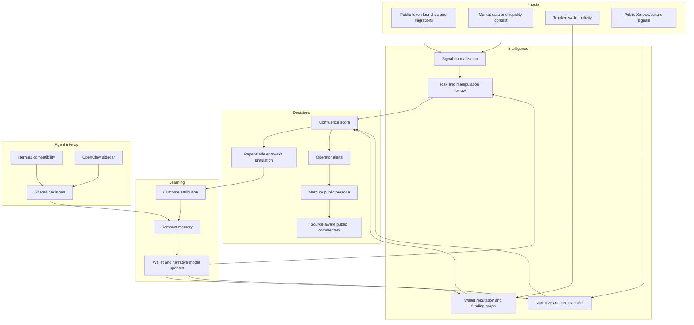

# Architecture Overview

Eclipse is a local-first autonomous agent runtime with isolated lanes for market ingestion, wallet intelligence, narrative context, risk scoring, paper-trade simulation, memory, and operator-facing social control.

This document describes the architecture at a public level. It avoids private source code, exact thresholds, wallet lists, prompts, API contracts, and execution logic.

## Operating Model

## Core Subsystems

### 1. Signal Ingestion

The ingestion layer watches public market and social sources, then normalizes raw events into candidate signals. It is built to separate launch noise from events with real follow-through, such as migration, post-graduation volume, wallet participation, or strong public narrative context.

### 2. Wallet Intelligence

The wallet layer studies tracked-wallet behavior over time. It observes entries, exits, round trips, timing, repeated success patterns, and funding relationships between wallets. The purpose is not to blindly copy wallets, but to understand which wallets add useful signal and which wallets are noise.

### 3. Risk And Manipulation Review

The risk layer looks for evidence that a setup is unsafe or low quality. Publicly describable checks include liquidity sanity, holder concentration, suspicious clustering, same-funder behavior, extreme volume-to-market-cap ratios, and stale or missing market data.

### 4. Narrative Intelligence

Eclipse tracks public cultural context: high-motion posts, news hooks, memes, token lore, tech narratives, and repeated social patterns. This lets the system distinguish generic launches from moments where attention, timing, and market behavior align.

### 5. Paper-Trade Simulation

The simulator records the decision as if it were a trade: entry market cap, simulated sizing, exit reason, exit timing, PnL, and strategy outcome. This creates feedback without publishing private execution infrastructure.

### 6. Memory And Coordination

Eclipse stores compact decisions and outcome summaries instead of dumping raw logs into memory. That gives later agents continuity without preserving secrets, private wallet material, browser data, or noisy runtime traces.

### 7. Source-Aware Social Control

The social layer is operator-controlled. Mercury is the public-facing persona for this layer: short, cryptic, meme-intel focused, and grounded in public source context. When Eclipse reacts publicly to an event, the design goal is to preserve context through a quote, repost, source URL, or thread instead of posting detached opinions.

Mercury should speak only when the source context is strong enough and public-safe. If the context is thin, not memable, or risk-heavy, the correct behavior is to skip.

### 8. Agent Interop: Hermes And OpenClaw

Eclipse can coordinate with adjacent local-agent tools without exposing the private runtime. Hermes is used as a compatibility lane for local agent tool-call formats and compact decision continuity. OpenClaw is used as an optional sidecar/gateway for workspace onboarding, heartbeat checks, and approved local-agent coordination.

These integrations do not replace Eclipse. They help external local agents work around the private runtime while the Eclipse system remains the owner of ingestion, scoring, memory, simulation, and operator controls.

## Trust Boundaries

| Boundary | Public posture |
| --- | --- |
| Public documentation | Safe to publish and inspect. |
| Runtime source code | Private. Not included in this repository. |
| Wallet state | Private. No keys, seeds, raw dumps, or operational wallet lists are published. |
| Browser/auth state | Private. No cookies, profiles, tokens, or signed-in session data are published. |
| Strategy implementation | Private. Public docs describe system areas only. |
| Social accounts | Operator-controlled. Public docs list only confirmed official links. |
| Mercury persona | Public docs describe the role and guardrails. Private prompts, exact rules, and runtime context are not published. |
| Hermes/OpenClaw integrations | Public docs describe role and boundary only. Private configuration and operational details are not published. |

## Design Principle

The public repo should make the system understandable without making the private runtime reproducible.
