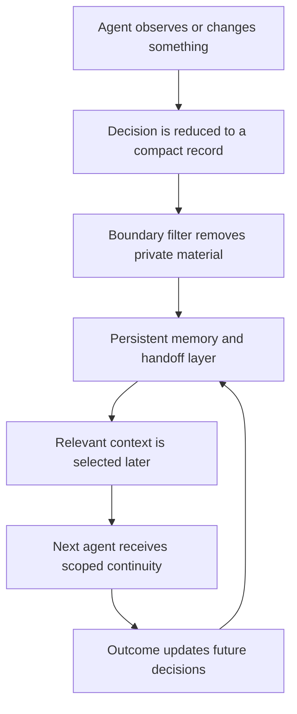

# Persistent Agent Memory

Eclipse treats memory as operating infrastructure, not as a bigger chat transcript.

Most agent systems reset at the boundary of a conversation, a model context window, or a single worker process. Eclipse is designed around the opposite assumption: important decisions, evidence, constraints, and outcomes should survive across agents, restarts, and handoffs without exposing the private runtime.

The public name for this layer is persistent agent memory.

## What It Does

Persistent memory gives Eclipse and approved local agent tools a shared continuity layer.

At a public level, it lets the system remember:

- What meaningful work was done.
- Which decision was made and why.
- Which evidence mattered.
- Which boundary or safety rule applied.
- Which subsystem changed.
- Which outcome should affect future decisions.
- Which follow-up is still open.

The memory layer is compact by design. It stores durable summaries and decision records instead of raw logs, full prompts, credentials, wallet dumps, browser state, or private runtime traces.

## Why It Matters

The important technical leap is not that an agent can save notes. The leap is that separate agents can keep working from the same durable operating context without needing one giant prompt or one permanently running model.

That means:

- A coding agent can fix a runtime issue and leave a compact record.
- A research agent can later understand the fix without replaying the whole session.
- A social persona can stay aligned with public-safe project facts without seeing private state.
- A market-intelligence loop can learn from simulated outcomes without exposing raw operational data.
- A restarted agent can recover the current state of the system instead of guessing.

This turns memory into a coordination primitive: agents do not just answer in isolation; they inherit the relevant state of the system.

## Public Architecture

## Record Shape

Publicly, a durable memory record can be described as a small structured summary:

| Field category | Public purpose |
| --- | --- |
| Time | When the decision or observation happened. |
| Agent identity | Which agent or subsystem produced the record. |
| Scope | Which subsystem the record applies to. |
| Decision | The concise fact that should survive handoff. |
| Evidence pointer | A non-sensitive pointer to why the decision was made. |
| Boundary note | Any privacy, security, or publication limit that applies. |
| Outcome tag | Whether the result was useful, noisy, unresolved, or needs review. |
| Next action | The smallest useful follow-up, if one exists. |

Private implementations can be richer than this public shape. The public repository does not publish internal schemas, private paths, prompts, thresholds, or operational state.

## Context Selection

Persistent memory is useful only if it stays selective. Eclipse is designed to pull relevant memory into the active agent context instead of dumping everything back into every prompt.

The selection idea is simple:

1. Determine the current task and subsystem.
2. Retrieve compact records that are relevant to that task.
3. Apply privacy and role boundaries.
4. Inject only the useful summaries into the current context.
5. Write back a new compact record after meaningful work.

This keeps continuity high while keeping prompt noise and private-data exposure low.

## Multi-Agent Continuity

Eclipse can coordinate across different agent surfaces while keeping the private runtime as the system of record.

Publicly describable examples include:

- Eclipse chat retaining the current operating state.
- Hermes-compatible local agents writing compact decision continuity.
- OpenClaw-style sidecars coordinating approved local-agent handoffs.
- Mercury receiving only public-safe context for social language.
- Paper-trade and simulation outcomes feeding future selectivity.

The same principle applies across all of them: agents share decisions, not unrestricted private state.

## Why This Is Different From Long Context

Long context helps a model read more text at once. Persistent memory solves a different problem.

| Long context | Persistent agent memory |
| --- | --- |
| Lives inside one model request. | Survives across sessions, tools, agents, and restarts. |
| Gets expensive and noisy as it grows. | Stores compact records selected by relevance. |
| Can mix secrets with normal working text. | Uses boundary filters before reuse or publication. |
| Usually helps one agent at a time. | Lets multiple agents inherit the same durable state. |
| Often forgets after the window resets. | Keeps continuity as part of the operating layer. |

The revolutionary part is continuity without prompt stuffing: the system can behave like it remembers because meaningful state is captured, scoped, filtered, and reused.

## Privacy Boundary

Persistent memory does not mean public memory.

This repository does not publish:

- Private runtime source code.
- Raw agent prompts or private reasoning traces.
- Credentials, cookies, browser profiles, or OAuth material.
- Wallet private keys, wallet watchlists, or raw wallet logs.
- Internal coordination files or runtime state.
- Exact thresholds, strategy rules, scoring formulas, or execution routes.

The public documentation explains the design. The private runtime owns the implementation.

## Design Principle

Eclipse memory is meant to make agents compound.

Each useful agent action should leave the system slightly more informed, more coordinated, and less likely to repeat the same mistake, while keeping sensitive operational data out of public view.
